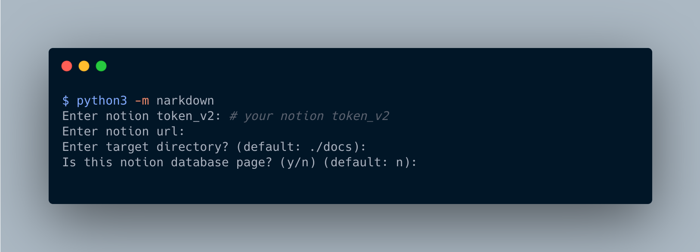
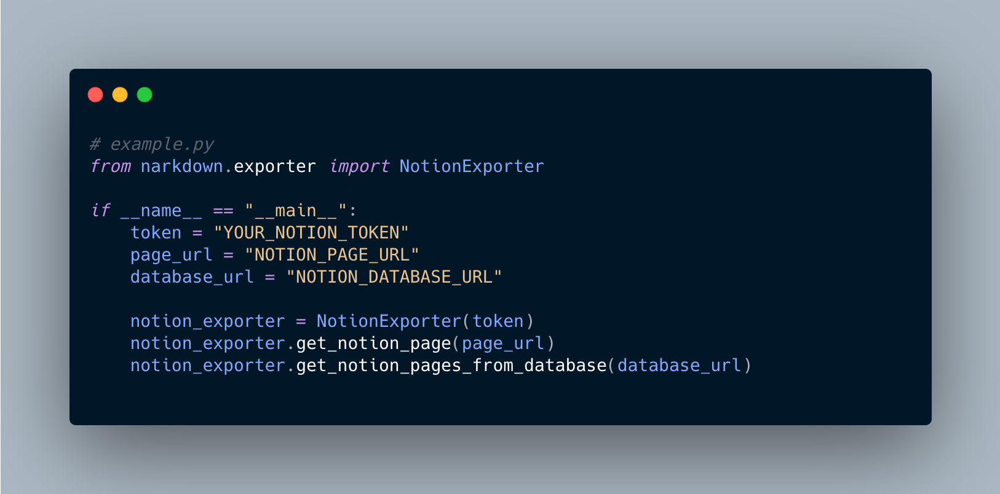

<a align="left" href="https://www.notion.so/Narkdown-4db9629e512f43efbba98000a5c2e381"></a>

# Narkdown

<p align="left">
  
  
  <a href="https://github.com/psf/black"></a>
  
</p>

| [English](/README.md) | [한국어](/docs/README.ko.md) |

**A tool to use Notion as a Markdown editor.**

---

> ⚠️ **NOTE:** Narkdown is dependent on [notion-py](https://github.com/jamalex/notion-py), the **_unofficial_** Notion API created by [Jamie Alexandre](https://github.com/jamalex). It can not gurantee it will stay stable. If you need to use in production, I recommend waiting for their official release.

---

## Installation

```bash
pip install narkdown
# pip3 install narkdown
```

## Usage

> ⚠️ **NOTE:** the latest version of narkdown requires Python 3.5 or greater.

### Quick Start

#### CLI



[How To Find Your Notion v2 Token - Red Gregory](https://www.redgregory.com/notion/2020/6/15/9zuzav95gwzwewdu1dspweqbv481s5)

#### Python

[`example.py`](https://github.com/younho9/narkdown/blob/main/example.py)



```bash
python3 example.py
```

#### Database template page for test

Here is an [database template page](https://www.notion.so/acc3dfd0339e4cacb5baae8673fddfad?v=be43c1c8dd644cfb9df9efd97d8af60a) for importing pages from the database. Move to that page, duplicate it, and test it.

<div align="center">
    
</div>

## Features

- **Import page from Notion and save it to the desired path.**

- **Import database from Notion and save pages to the desired path.**

  - Useful for CMS(Contents Manage System) of static pages such as blog or docs page.

  - Support import by status of content.

  - Support filter contents.

- **Import** **_child page_** **in Notion page recursively. And import** **_linked page_** **as a Notion page link.**

- **Support nested block. (e.g. bulleted, numbered, to-do, toggle)**

- **Support language selection of code block.**

## Configuring Narkdown

Narkdown provides some configuration for how to extract documents. You can configure Narkdown via `narkdown.config.json` .

Create `narkdown.config.json` and run `python3 -m narkdown` in that directory.

```json
// narkdown.config.json
{
  "exportConfig": {
    "recursiveExport": true,
    "createPageDirectory": true,
    "addMetadata": false,
    "lowerPathname": false,
    "lowerFilename": false,
    "lineBreak": false
  },
  "databaseConfig": {
    "categoryColumnName": "Category",
    "tagsColumnName": "Tags",
    "createdTimeColumnName": "Created Time",
    "statusColumnName": "Status",
    "currentStatus": "✅ Completed",
    "nextStatus": "🖨 Published"
  }
}
```

| Name                  | Description                                                                      | Default |
| --------------------- | -------------------------------------------------------------------------------- | ------- |
| `recursiveExport`     | Whether or not to recursively export child page.                                 | `true`  |
| `createPageDirectory` | Whether or not to create subdirectories with page titles for each page.          | `true`  |
| `addMetadata`         | Whether or not to add metadata to content.                                       | `false` |
| `lowerPathname`       | Whether or not to make pathname to lowercase.                                    | `false` |
| `lowerFilename`       | Whether or not to make filename to lowercase.                                    | `false` |
| `lineBreak`           | Whether or not to convert empty blocks of notion to line break tag. ( `<br />` ) | `false` |

| Name                    | Description                                                                                                                                                                                                                                                                                                                       | Default |
| ----------------------- | --------------------------------------------------------------------------------------------------------------------------------------------------------------------------------------------------------------------------------------------------------------------------------------------------------------------------------- | ------- |
| `categoryColumnName`    | In Notion database, content can be classified by category by `select` property. When you create the `select` property in the Notion database and pass the name of the column, folders are created by category.                                                                                                                    | `""`    |
| `tagsColumnName`        | In the Notion database, you can tag content with `Multi Select` property. If you create a `Multi Select` property in the Notion database and pass the name of the column, then meta data will be insterted to contents. (should set `addMetadata` to True.)                                                                       | `""`    |
| `createdTimeColumnName` | In the Notion database, you can manage created time of content with `Created Time` property. If you create a `Created Time` property in the Notion database and pass the name of the column, you can add created time to filename. (e.g. `2020-12-02-some-title.md` )                                                             | `""`    |
| `statusColumnName`      | In the Notion database, you can manage the status of content with `Select` property. If you create a `Select` property in the Notion database and pass the name of the column, you can import contents in a specific state or change the status of the content. (should be used with the `currentStatus` or `nextStatus` option.) | `""`    |
| `currentStatus`         | Import only the content that corresponds to `currentStatus` value. ( `statusColumnName` must be set.)                                                                                                                                                                                                                             | `""`    |
| `nextStatus`            | Changes content status to `nextStatus` value after import. ( `statusColumnName` must be set.)                                                                                                                                                                                                                                     | `""`    |

#### Set env variable for `token_v2`

The `token_v2` of notion is a variable that should not be shared. You can use os environment variable for notion token.

Narkdown use the `NOTION_TOKEN` as an environment variable for `token_v2`. Setting this environment variable allow the CLI to omit `token_v2` input.

## Advanced

### [Notion2Github](https://github.com/younho9/notion2github) `recommended`

Github action to synchronize the content of the notion database with github.

## Supported Blocks

| Block Type           | Supported  | Notes                                                                                           |
| -------------------- | ---------- | ----------------------------------------------------------------------------------------------- |
| Heading 1            | ✅ Yes     | [Converted to heading 2 in markdown.](https://www.notion.so/11acfd542ee84640b3fb1782ce9b8caa)   |
| Heading 2            | ✅ Yes     | [Converted to heading 3 in markdown.](https://www.notion.so/11acfd542ee84640b3fb1782ce9b8caa)   |
| Heading 3            | ✅ Yes     | [Converted to heading 4 in markdown.](https://www.notion.so/11acfd542ee84640b3fb1782ce9b8caa)   |
| Text                 | ✅ Yes     |                                                                                                 |
| Divider              | ✅ Yes     | Divider after the Heading 1 is not added.                                                       |
| Callout              | ✅ Yes     | Callout block will be exported as quote block with emoji.                                       |
| Quote                | ✅ Yes     |                                                                                                 |
| Bulleted list        | ✅ Yes     | Support nested block.                                                                           |
| Numbered list        | ✅ Yes     | Support nested block.                                                                           |
| To-do list           | ✅ Yes     | Support nested block.                                                                           |
| Toggle list          | ✅ Yes     | Support nested block.                                                                           |
| Code                 | ✅ Yes     | Support syntax highlighting.                                                                    |
| Image                | ✅ Yes     | Uploaded image will be downloaded to local. Linked image will be linked not be downloaded.      |
| Web bookmark         | ✅ Yes     | Same as link text.                                                                              |
| Page                 | ✅ Yes     | Import "Child page" in Notion page recursively. And import "Linked page" as a Notion page link. |
| Table (aka database) | ⚠️ Partial | ⚠️ The sequence of columns is not guaranteed.                                                   |
| Video                | ❌ No      |                                                                                                 |
| Audio                | ❌ No      |                                                                                                 |
| File                 | ❌ No      |                                                                                                 |
| Embed other services | ❌ No      |                                                                                                 |
| Advanced             | ❌ No      |                                                                                                 |
| Layout in page       | ❌ No      |                                                                                                 |

### License

MIT © [younho9](https://github.com/younho9)
