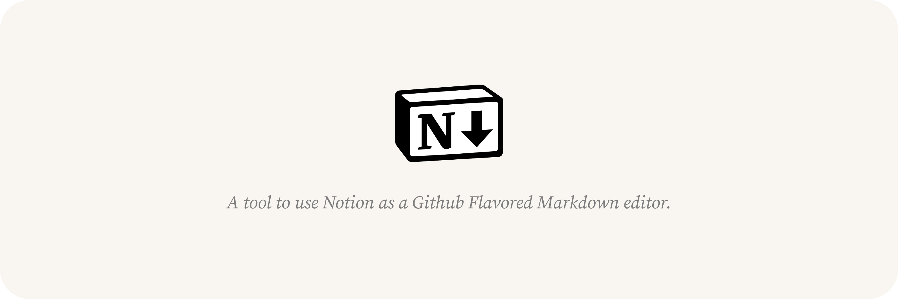
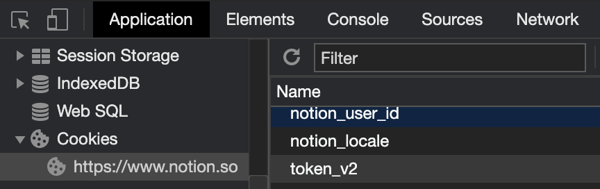
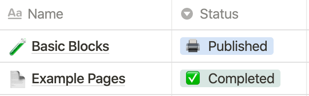
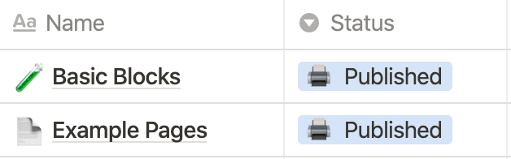

# Notion2Github



A tool to use Notion as a [Github Flavored Markdown(aka GFM)](https://github.github.com/gfm/) editor.

[View in Notion](https://bit.ly/2ZRElQg)

---

> ⚠️ **_NOTE:_** [Notion2Github](https://github.com/younho9/notion2github) uses customized version of [notion-py](https://github.com/jamalex/notion-py) created by [Jamie Alexandre](https://github.com/jamalex). That repository seems to be abandoned.
> Also, this is based on the private Notion API. It can not gurantee it will stay stable. If you need to use in production, I recommend waiting for their official release.

---

## Features

- **Import a Notion page and save it to the desired path.**
  Useful for simple markdown exporter.

- **Import Notion pages from database to the desired path.**
  Useful for CMS(Contents Manage System) of static pages such as blog or docs page.

      - Support import by status of content.

      - Support filter contents.

- **Import "Child page" in Notion page recursively. And import "Linked page" as a Notion page link.**

- **Support nested block. (e.g. bulleted, numbered, to-do, toggle)**

- **Support syntax highlighting in code block.**

## Usage

### Quickstart

> ⚠️ **_NOTE:_** the latest version of [notion2github](https://github.com/younho9/notion2github) requires Python 3.5 or greater.

1. Install dependencies

   `pip install notion2github`

1. Get `token_v2` cookie from a logged-in browser session on Notion.so.

   

1. Add [`config.py`](https://github.com/younho9/notion2github/blob/main/config.py.example) in root directory

   ```python
   token=
   database_url=
   page1_url=
   page2_url=
   page3_url=
   page4_url=
   # ... and so on
   ```

1. Use it like an [`example.py`](https://github.com/younho9/notion2github/blob/main/example.py)

   ```python
   import sys
   from config import token, page1_url, page2_url, database_url
   from notion2github.exporter import NotionExporter

   if __name__ == "__main__":
       # Get project README.md
       NotionExporter(token, ".").get_notion_page(
           url=page1_url, create_page_directory=False
       )

       # Get directory README.md
       NotionExporter(token, "./docs").get_notion_page(
           url=page2_url, create_page_directory=False
       )

       # Get all contents from database
       NotionExporter(token).get_notion_pages_from_database(
           url=database_url,
           category_column_name="Category",
           status_column_name="",
           current_status="",
           next_status="",
           filters={},
       )
   ```

### Examples

- <details><summary>Click here.</summary>

  #### Example : Categorize content by "Select" property.

  - Create "Select" column and specify category by page.

    

  - Pass `category_column_name` to parameter.

    ```python
    NotionExporter(token).get_notion_pages_from_database(
        url=database_url,
        category_column_name="Category"
    )
    ```

  #### Example : Get content by status.

  - Create "Select" column and specify status of page.

    

  - Pass `status_column_name`, `current_status`, `next_status` to parameter.

    ```python
    NotionExporter(token).get_notion_pages_from_database(
        url=database_url,
        status_column_name="Status",
        current_status="✅ Completed",
        next_status="🖨 Published"
    )
    ```

  - After extract page, status will be changed.

    

  #### Example : Apply filter

  - Pass key, value pair of filter list to `filters` parameter.

    ```python
    NotionExporter(token).get_notion_pages_from_database(
        url=database_url,
        filter={"Name" : "Basic Blocks"}
    )
    ```

  </details>

## Supported Blocks

[View supported blocks by type](/acc3dfd0339e4cacb5baae8673fddfad?v=83b3d2a66f634940987d1142e51da175)

| Notes                                                                                           | Supported         | Block Type           |
| ----------------------------------------------------------------------------------------------- | ----------------- | -------------------- |
| [Converted to heading 2 in markdown.](https://bit.ly/3hEM8ak)                                   | ✅Support         | Heading 1            |
| [Converted to heading 3 in markdown.](https://bit.ly/3hEM8ak)                                   | ✅Support         | Heading 2            |
| [Converted to heading 4 in markdown.](https://bit.ly/3hEM8ak)                                   | ✅Support         | Heading 3            |
|                                                                                                 | ✅Support         | Text                 |
| Divider after the Heading 1 is not added.                                                       | ✅Support         | Divider              |
| Callout block will be exported as quote block with emoji.                                       | ✅Support         | Callout              |
|                                                                                                 | ✅Support         | Quote                |
| Support nested block.                                                                           | ✅Support         | Bulleted list        |
| Support nested block.                                                                           | ✅Support         | Numbered list        |
| Support nested block.                                                                           | ✅Support         | To-do list           |
| Support nested block.                                                                           | ✅Support         | Toggle list          |
| Support syntax highlighting.                                                                    | ✅Support         | Code                 |
| Uploaded image will be downloaded to local. Linked image will be linked not be downloaded.      | ✅Support         | Image                |
| Same as link text.                                                                              | ✅Support         | Web bookmark         |
| Import "Child page" in Notion page recursively. And import "Linked page" as a Notion page link. | ✅Support         | Page                 |
| ⚠️The sequence of columns is not guaranteed.                                                    | ⚠️Partial Support | Table (aka database) |
|                                                                                                 | ❌Not Support     | Video                |
|                                                                                                 | ❌Not Support     | Audio                |
|                                                                                                 | ❌Not Support     | File                 |
|                                                                                                 | ❌Not Support     | Embed other services |
|                                                                                                 | ❌Not Support     | Advanced             |
|                                                                                                 | ❌Not Support     | Layout in page       |

### License

MIT ©[younho9](https://github.com/younho9)
