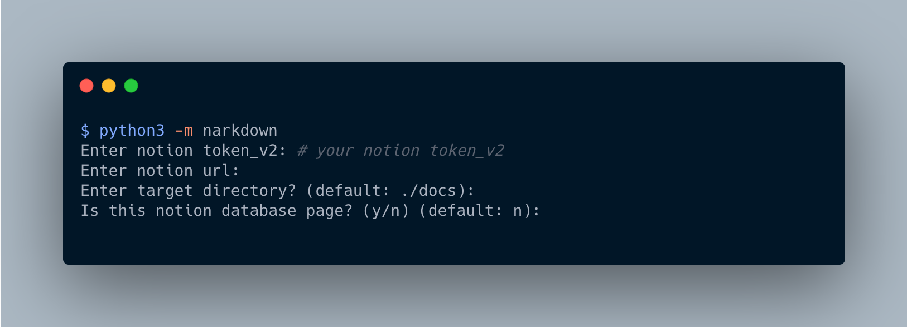
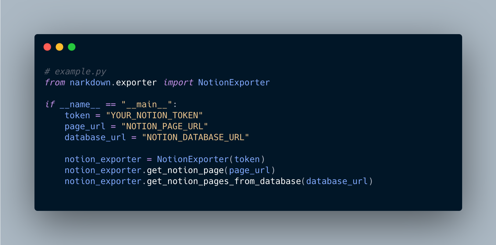

<a align="left" href="https://www.notion.so/Narkdown-ko-c9590ebd17ff492ebe1a0c3d573686e5"></a>

# Narkdown

<p align="left">
  
  
  <a href="https://github.com/psf/black"></a>
  
</p>

| [English](/README.md) | [한국어](/docs/README.ko.md) |

**노션을 마크다운 에디터로 쓰기 위한 도구**

---

> ⚠️ **유의사항:** Notion2Github은 [Jamie Alexandre](https://github.com/jamalex)이 만든 **_비공식_** 노션 API인 [notion-py](https://github.com/jamalex/notion-py) 프로젝트에 의존하고 있습니다. 공식 API가 아니기 때문에 안정적이지 않을 수 있습니다. 프로덕션 환경에서 사용하고자 한다면, 노션 공식 API 출시를 기다리는 것을 권장합니다.

---

## 설치

```bash
pip install narkdown
# pip3 install narkdown
```

## 사용법

> ⚠️ **유의사항:** Narkdown의 최신 버전은 Python 3.5 이상의 버전에서 동작합니다.

### 바로 시작하기

#### CLI



[How To Find Your Notion v2 Token - Red Gregory](https://www.redgregory.com/notion/2020/6/15/9zuzav95gwzwewdu1dspweqbv481s5)

#### Python

[`example.py`](https://github.com/younho9/narkdown/blob/main/example.py)



```bash
python3 example.py
```

#### 테스트를 위한 데이터베이스 템플릿 페이지

데이터베이스로부터 페이지들을 가져올 수 있는 [데이터베이스 템플릿 페이지](https://www.notion.so/acc3dfd0339e4cacb5baae8673fddfad?v=be43c1c8dd644cfb9df9efd97d8af60a)가 있습니다.

페이지로 이동해서 복제하고 테스트해볼 수 있습니다.


## 기능

- **노션에서 페이지를 가져와서 원하는 경로에 저장.**

- **노션에서 데이터베이스를 가져와서 페이지들을 원하는 경로에 저장.**

  - 블로그나 문서 페이지 같은 정적 페이지의 CMS(Contents Manage System)으로 유용합니다.

  - 콘텐츠의 상태에 따라 가져오는 기능 지원

  - 콘텐츠를 필터링하는 기능 지원

- **노션 페이지의** **_하위 페이지_\*\***들을 재귀적으로 가져옴.\*\* **_링크된 페이지_\*\***는 노션 페이지 링크로 가져옴.\*\*

- **중첩 블록 지원. ex) 순서 없는 리스트, 순서 있는 리스트, 투두, 토글**

- **코드 블록의 언어 선택 지원.**

## Narkdown 환경설정

Narkdown은 문서들을 어떻게 추출할 것인지에 대해 몇가지 환경설정을 제공합니다. `narkdown.config.json` 파일을 통해서 Narkdown을 환경설정할 수 있습니다.

디렉토리에 `narkdown.config.json` 파일을 생성하고 해당 디렉토리에서 `python3 -m narkdown` 명령을 실행하세요.

```json
// narkdown.config.json
{
  "exportConfig": {
    "recursiveExport": true,
    "createPageDirectory": true,
    "addMetadata": false,
    "lowerPathname": false,
    "lowerFilename": false,
    "lineBreak": false
  },
  "databaseConfig": {
    "categoryColumnName": "Category",
    "tagsColumnName": "Tags",
    "createdTimeColumnName": "Created Time",
    "statusColumnName": "Status",
    "currentStatus": "✅ Completed",
    "nextStatus": "🖨 Published"
  }
}
```

| Name                  | Description                                                     | Default |
| --------------------- | --------------------------------------------------------------- | ------- |
| `recursiveExport`     | 하위 페이지를 재귀적으로 추출할 것인지 여부                     | `true`  |
| `createPageDirectory` | 페이지마다 페이지 제목으로 하위 디렉토리를 생성할 것인지 여부   | `true`  |
| `addMetadata`         | 콘텐츠에 메타데이터를 추가할 것인지 여부                        | `false` |
| `lowerPathname`       | 경로 이름을 소문자로 할 것인지 여부                             | `false` |
| `lowerFilename`       | 파일이름을 소문자로 할 것인지 여부                              | `false` |
| `lineBreak`           | 노션의 빈 블록들을 줄바꿈 태그( `<br />` )로 변환할 것인지 여부 | `false` |

| Name                    | Description                                                                                                                                                                                                                                                                                     | Default |
| ----------------------- | ----------------------------------------------------------------------------------------------------------------------------------------------------------------------------------------------------------------------------------------------------------------------------------------------- | ------- |
| `categoryColumnName`    | 노션 데이터베이스에서 콘텐츠는 `선택` 속성으로 카테고리별로 분류할 수 있습니다. 노션 데이터베이스에 `선택` 속성을 생성하고, 해당 속성의 이름을 전달하면, 카테고리별로 폴더가 생성됩니다.                                                                                                        | `""`    |
| `tagsColumnName`        | 노션 데이터베이스에서 `다중 선택` 속성으로 내용에 태그를 지정할 수 있습니다. 노션 데이터베이스에 `다중 선택` 속성을 생성하고 해당 속성의 이름을 전달하면, 메타데이터로 콘텐츠에 삽입됩니다. ( `addMetadata` 가 True로 설정되어 있어야 합니다.)                                                  | `""`    |
| `createdTimeColumnName` | 노션 데이터베이스에서 `생성일시` 속성으로 콘텐츠의 작성 시간을 관리할 수 있습니다. 노션 데이터베이스에 `생성일시` 속성을 생성하고 해당 속성의 이름을 전달하면 작성된 시간이 파일 이름에 추가됩니다. ex) `2020-12-02-제목.md`                                                                    | `""`    |
| `statusColumnName`      | 노션 데이터베이스에서 `선택` 속성으로 콘텐츠의 상태를 관리할 수 있습니다. 노션 데이터베이스에 `선택` 속성을 생성하고 해당 속성의 이름을 전달하면, 특정 상태의 콘텐츠를 가져오거나, 가져온 이후 콘텐츠의 상태를 변경할 수 있습니다. (`currentStatus`, `nextStatus` 옵션과 함께 사용해야 합니다.) | `""`    |
| `currentStatus`         | `currentStatus` 에 해당하는 콘텐츠만 가져옵니다. ( `statusColumnName` 옵션이 설정되어 있어야 합니다.)                                                                                                                                                                                           | `""`    |
| `nextStatus`            | 콘텐츠를 가져온 이후 `nextStatus` 로 콘텐츠의 상태를 변경합니다.( `statusColumnName` 옵션이 설정되어 있어야 합니다.)                                                                                                                                                                            | `""`    |

#### `token_v2` 환경 변수를 설정하세요.

노션의 `token_v2` 는 공유되면 안되는 변수입니다. 노션 토큰을 위해 운영체제의 환경 변수를 사용할 수 있습니다.

Narkdwon은 `NOTION_TOKEN` 를 `token_v2` 환경 변수로 사용합니다. 이 환경 변수를 설정함으로 CLI에서 `token_v2` 입력을 생략할 수 있습니다.

## 더 알아보기

### [Notion2Github](https://github.com/younho9/notion2github) `recommended`

노션 데이터베이스의 콘텐츠를 깃헙과 동기화하는 깃헙 액션

## 지원하는 블록들

| Block Type           | Supported  | Notes                                                                                                   |
| -------------------- | ---------- | ------------------------------------------------------------------------------------------------------- |
| Heading 1            | ✅ Yes     | [마크다운의 헤딩 2으로 변환됩니다.](/11acfd542ee84640b3fb1782ce9b8caa)                                  |
| Heading 2            | ✅ Yes     | [마크다운의 헤딩 3으로 변환됩니다.](/11acfd542ee84640b3fb1782ce9b8caa)                                  |
| Heading 3            | ✅ Yes     | [마크다운의 헤딩 4로 변환됩니다.](/11acfd542ee84640b3fb1782ce9b8caa)                                    |
| Text                 | ✅ Yes     |                                                                                                         |
| Divider              | ✅ Yes     | 헤딩 1 이후의 구분자는 생략됩니다.                                                                      |
| Callout              | ✅ Yes     | 콜아웃 블록은 이모지와 함께 있는 인용 블록으로 변환됩니다.                                              |
| Quote                | ✅ Yes     |                                                                                                         |
| Bulleted list        | ✅ Yes     | 중첩 블록 지원                                                                                          |
| Numbered list        | ✅ Yes     | 중첩 블록 지원                                                                                          |
| To-do list           | ✅ Yes     | 중첩 블록 지원                                                                                          |
| Toggle list          | ✅ Yes     | 중첩 블록 지원                                                                                          |
| Code                 | ✅ Yes     | 문법 하이라이팅 지원                                                                                    |
| Image                | ✅ Yes     | 업로드된 이미지는 로컬로 저장됩니다. 링크된 이미지는 다운로드되지 않고 링크됩니다.                      |
| Web bookmark         | ✅ Yes     | 링크된 텍스트로 변환됩니다.                                                                             |
| Page                 | ✅ Yes     | 노션 페이지의 *하위 페이지*들을 재귀적으로 가져옵니다. *링크된 페이지*는 노션 페이지 링크로 가져옵니다. |
| Table (aka database) | ⚠️ Partial | ⚠️ 노션 테이블 열의 순서가 지켜지지 않습니다.                                                           |
| Video                | ❌ No      |                                                                                                         |
| Audio                | ❌ No      |                                                                                                         |
| File                 | ❌ No      |                                                                                                         |
| Embed other services | ❌ No      |                                                                                                         |
| Advanced             | ❌ No      |                                                                                                         |
| Layout in page       | ❌ No      |                                                                                                         |

### License

MIT © [younho9](https://github.com/younho9)
